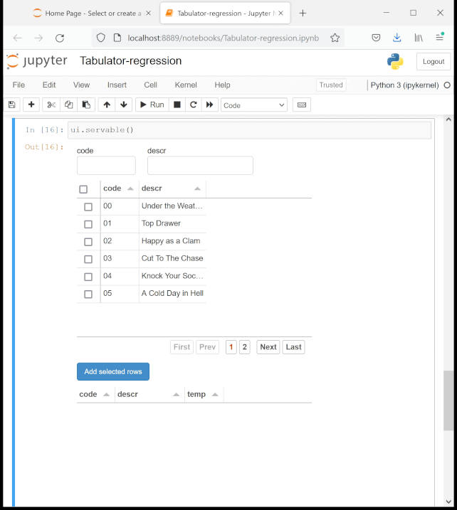
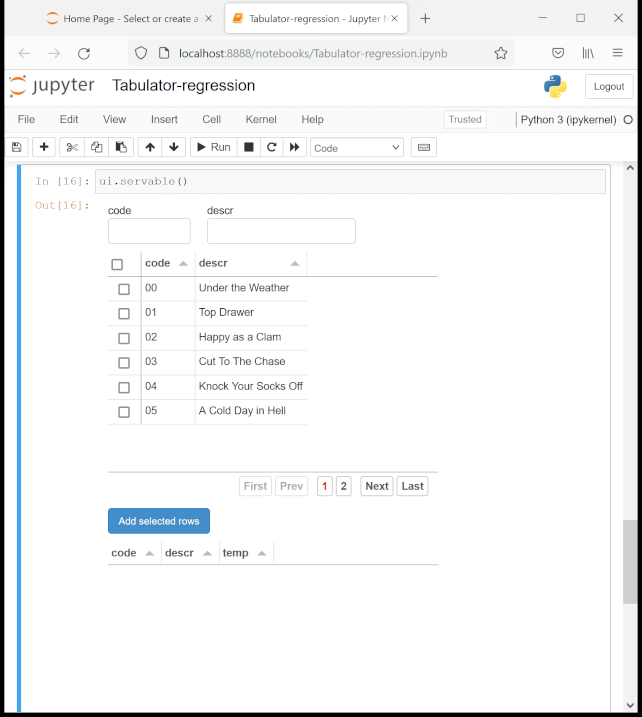

# Regression in Tabulator widget for panel>0.12.1

Copying selected rows from the DataFrame behind a filtered Tabulator widget
succeeds for panel=0.12.1 but fails with an `IndexError` for panel>=0.12.2.

## Environment

OS:
  - Windows 10
  - version 1909
  - build 18363.1679

conda environment:
  - bokeh=2.4.1
  - ipython=7.29.0
  - jupyter_client=7.0.6
  - jupyter_core=4.9.1
  - notebook=6.4.5
  - openpyxl=3.0.9
  - pandas=1.3.4
  - panel=0.12.4 (or 0.12.3 or 0.12.2)
  - param=1.12.0
  - python=3.9.7

## Steps to reproduce

  1. Create conda environments from the .yml files.
  2. Run the MRE in the Jupyter notebook Tabulator-regression.ipynb
  3. The bug can be reproduced by either:
      * running the bottom 4 cells of the notebook; or
      * using the GUI:
          * enter e.g. "cut" in the "descr" filter box;
          * select some or all of the filtered rows;
          * click the "Add selected rows" button;
  4. Result:
      * 5 rows appear in the lower Tabulator (for panel=0.12.1)
          * top 2 rows selected from the unfiltered (top) Tabulator
          * bottom 3 rows selected from the filtered (top) Tabulator
      * 2 rows appear in the lower Tabulator (for panel>=0.12.2)
          * only the top 2 rows selected from the unfiltered (top) Tabulator
          * no rows are added when selected from the filtered (top) Tabulator

## Results

### Expected result

Running all the cells in the notebook with panel=0.12.1 will show the
following in the lower Tabulator:

code | descr             | temp
-----|-------------------|-----
 00  | Under the Weather | 1.0
 01  |        Top Drawer | 1.0
 03  |  Cut To The Chase | 1.0
 07  |       A Cut Above | 1.0
 08  |   Cut The Mustard | 1.0

### Actual result

Running all the cells in the notebook with panel>=0.12.2 will show the
following in the lower Tabulator:

code | descr             | temp
-----|-------------------|-----
 00  | Under the Weather | 1.0
 01  |        Top Drawer | 1.0

## Screenshots

### Succeeds for panel=0.12.1

### Fails for panel>=0.12.2

